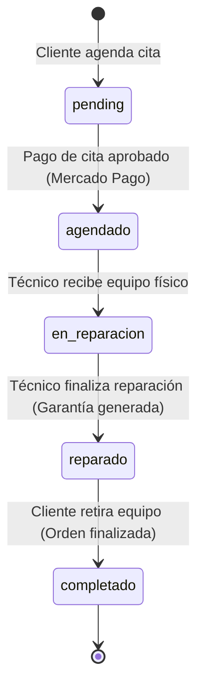

# 🚀 Plan de Desarrollo y Rediseño Premium - TechFix

Este documento presenta una planificación exacta, detallada y estructurada para llevar el proyecto **TechFix** desde su estado actual de desarrollo temprano hasta su culminación exitosa, cumpliendo con los estándares de comercio electrónico moderno, sistemas de reparación y diseño de interfaces de nivel premium.

---

## 📊 1. Estado Actual y Diagnóstico del Sistema

### 🔗 Conexión Frontend-Backend
El proyecto cuenta con una excelente base arquitectónica:
*   **Backend (Go/Gin/GORM):** Una API REST robusta conectada a PostgreSQL con soporte para transacciones, autenticación JWT, pre-diagnóstico y pagos integrados con el SDK de Mercado Pago.
*   **Frontend (Next.js 15/React 19/TS):** Interfaz modularizada que se conecta de manera directa con el backend a través de **Next.js Server Actions** (`use server` en `src/actions/*.ts`) y redireccionamiento por proxy en `next.config.ts` (`/api/:path*` redireccionado a `http://localhost:8080`).

### 📦 Datos Mockeados vs. Datos Reales
A diferencia de versiones de desarrollo previas, la mayoría de los dashboards (admin, técnico y cliente) cargan datos reales desde la BD. No obstante, persisten los siguientes elementos simulados o mockeados:
1.  **Árbol de Decisión (Pre-diagnóstico PIG):** En el backend se implementan controladores dinámicos para el árbol de decisión, pero el frontend consume la estructura simulada en `src/data/diagnosticTree.json` usando acciones de memoria local en `src/actions/data.ts`.
2.  **Checkout de Productos (E-commerce):** El proceso de checkout y confirmación de compra de productos tecnológicos en el catálogo está 100% mockeado en el frontend. Guarda los pedidos ficticios en `localStorage` (`techfix_last_order`) sin realizar inserciones en la base de datos ni invocar al backend.
3.  **Fase de Pago en Reparaciones:** Aunque el backend cuenta con soporte real para Mercado Pago, el frontend simula el pago de citas técnicas e insumos mediante timeouts y llamadas directas con tokens de prueba simulados.

---

## 🔄 2. Mapa de Flujos del Sistema y Estados

Las órdenes de reparación se rigen bajo una máquina de estados controlada por base de datos:

### 👥 Interacciones por Rol

*   **Cliente:** Realiza pre-diagnóstico (PIG/IA) $\rightarrow$ Elige tipo de repuesto (Original, Compatible, Económico) $\rightarrow$ Registra cita y dispositivo $\rightarrow$ Paga la cita técnica $\rightarrow$ Hace seguimiento del timeline $\rightarrow$ Retira el equipo $\rightarrow$ Visualiza certificado de garantía digital.
*   **Técnico:** Administra el tablero Kanban de reparaciones $\rightarrow$ Recepciona el equipo (cambia estado a `en_reparacion`) $\rightarrow$ Escribe notas de diagnóstico presencial $\rightarrow$ Vincula repuestos consumidos de inventario $\rightarrow$ Finaliza reparación (cambia estado a `reparado` e inicia garantía) $\rightarrow$ Entrega equipo (cambia estado a `completado`).
*   **Administrador:** Visualiza ingresos y reportes operativos $\rightarrow$ Administra catálogo de productos y stock $\rightarrow$ Registra y evalúa proveedores $\rightarrow$ Realiza órdenes de compra/reabastecimiento $\rightarrow$ Gestiona roles y estados de los usuarios (Clientes, Técnicos, Administradores).

---

## ⚠️ 3. Brechas Identificadas y Bugs Críticos (Gaps & Bugs)

Durante el análisis del código, se detectaron los siguientes puntos que deben corregirse prioritariamente para garantizar la integridad y estabilidad del sistema:

| ID | Módulo | Descripción / Efecto | Acción de Mitigación |
| :--- | :--- | :--- | :--- |
| **BUG-01** | Inventario | **Doble descuento de stock:** Al vincular un repuesto a una reparación, el frontend llama a `addPartToRepairAction` (donde el backend ya descuenta el stock en la BD) y luego llama a `updateProductAction` con el stock restante disminuido de forma manual en el cliente. Esto provoca que se descuente **el doble** del stock real. | Eliminar la llamada redundante a `updateProductAction` del frontend. Dejar la transacción en el backend. |
| **GAP-02** | Citas (PIG) | **Citas Hardcodeadas:** Al terminar el diagnóstico guiado por IA, la cita técnica se genera con fecha, hora, número de serie del equipo y sucursal físicas fijos e inalterables desde el código. | Diseñar e integrar la interfaz de selección de fecha (Calendario), hora, sucursal, ingreso de S/N real y subida de fotografía de la falla. |
| **GAP-03** | Mercado Pago | **Pasarela de Pagos Simulada:** Los formularios de pago solo emulan el comportamiento usando un temporizador local. El backend cuenta con SDK de Mercado Pago pero requiere credenciales reales y tokens seguros enviados desde el frontend. | Implementar el SDK de Mercado Pago JS (Bricks/CardForm) en el frontend y configurar el webhook `/api/webhooks/mercado-pago`. |
| **GAP-04** | Inventario | **Falta UI de Reabastecimiento:** A pesar de contar con modelos de datos en el backend para generar pedidos a proveedores, no hay una interfaz administrativa en el frontend para ejecutar estas órdenes. | Desarrollar la interfaz "Órdenes de Compra a Proveedores" dentro de `/admin/inventario`. |
| **GAP-05** | Garantías | **Reclamación Inexistente:** El cliente puede ver su garantía pero no puede interactuar con ella en caso de fallas recurrentes. | Crear botón "Reclamar Garantía" que abra un ticket prioritario sin costo asociado. |

---

## 🛠️ 4. Plan de Implementación de Mejoras (Paso a Paso)

A continuación, se detalla la hoja de ruta técnica dividida en fases y tareas estructuradas.

### 📅 FASE 1: Estabilización de Datos y Corrección de Bugs Críticos
*   **Corrección del Bug del Inventario (BUG-01):**
    *   Modificar `TecnicoDashboardClient.tsx` para eliminar la llamada simultánea a `updateProductAction`.
    *   Asegurar que la reducción de stock de productos ocurra exclusivamente en el backend mediante la función transaccional `AddPartToRepair` de GORM.
*   **Conexión del Flujo AI Diagnostic al Backend:**
    *   Reemplazar el árbol estático mockeado de `diagnosticTree.json` por el motor de diagnóstico dinámico asistido por LLM (Llama 3.3 vía Groq) disponible en el backend en los endpoints `/api/diagnostic/start` y `/api/diagnostic/answer`.
*   **Completitud del Checkout de E-commerce:**
    *   Crear endpoints en el backend para guardar transacciones de productos del catálogo.
    *   Conectar el carrito de compras al backend al presionar "Completar Compra", registrando la transacción en la tabla `transacciones` y `transaccion_producto` en PostgreSQL.

### 📅 FASE 2: Implementación de la Pasarela de Pagos (Mercado Pago Bricks)
*   **Integración en Frontend:**
    *   Agregar el script oficial de Mercado Pago JS en `layout.tsx`.
    *   Inicializar Mercado Pago con la clave pública de prueba (`public_key`).
    *   Implementar el componente **Payment Brick** o **Card Payment Brick** en la pantalla de pago de citas y compras para generar el token de tarjeta seguro.
*   **Integración en Backend:**
    *   Asegurar la carga de variables de entorno `MERCADO_PAGO_ACCESS_TOKEN` y `NOTIFICATION_URL` en el servidor Go.
    *   Configurar el endpoint `/api/webhooks/mercado-pago` para capturar estados asíncronos (`approved`, `rejected`, `pending`) y actualizar automáticamente la base de datos local.

### 📅 FASE 3: Interfaz de Citas y Reclamación de Garantías
*   **Wizard de Citas Dinámico:**
    *   Añadir el paso de selección de fecha y hora libre usando un componente de calendario interactivo.
    *   Permitir seleccionar la sucursal de atención técnica preferida.
    *   Permitir subir una imagen representativa del equipo dañado (opcional) a través de un Drag & Drop que almacene el archivo.
*   **Reclamación de Garantías Activas:**
    *   Desarrollar el modal "Reclamar Garantía" en el panel del cliente.
    *   Crear endpoint `/api/repairs/warranty-claim` en el backend que reciba el ID de la garantía y registre un ticket técnico de reparación asociado en estado `pending` con etiqueta de "Garantía de Servicio".

### 📅 FASE 4: Módulo de Proveedores y Compras
*   **Panel Administrativo de Reabastecimiento:**
    *   Crear una interfaz de control en `/admin/inventario` que filtre repuestos en desabastecimiento (stock por debajo del mínimo).
    *   Habilitar un flujo para seleccionar el proveedor, ingresar cantidad de insumos a ordenar, y presionar "Enviar Orden de Compra", consumiendo el endpoint `/api/suppliers/orders`.

---

## 🎨 5. Propuesta de Rediseño Espectacular (UX/UI Premium)

El rediseño se enfocará en lograr una estética visual inspirada en plataformas modernas y premium. Implementará una interfaz fluida, interactiva y sofisticada basada en los siguientes lineamientos:

### 🌓 A. Evolución del Sistema de Diseño (Tailwind CSS v4)
*   **Contraste y Profundidad (Modo Oscuro):** Reemplazar la base azul marino clara por una combinación de grises profundos, negros orgánicos y detalles en cian eléctrico (`slate-950` de fondo base y `#0a1128` como color de superficie).
*   **Bordes Luminosos (Spotlight Effect):** Utilizar efectos de Spotlight en las tarjetas de estadísticas del administrador y servicios del cliente, donde el borde se ilumina sutilmente según la posición del mouse del usuario.
*   **Efecto de Cristal (Glassmorphic Cards):** Implementar tarjetas con transparencias difuminadas a través del uso de `backdrop-blur-xl` y bordes de alta fidelidad semi-transparentes (`border-white/10`).

### 💫 B. Micro-animaciones e Interacción Dinámica
1.  **Transiciones en el Diagnóstico Inteligente:** Eliminar cambios de interfaz bruscos. Diseñar un sistema de deslizamiento horizontal suave entre cada pregunta del diagnóstico asistido por IA.
2.  **Cargas Inteligentes (Skeleton Loader):** En lugar de spinners genéricos, utilizar esqueletos con brillo progresivo animado que sigan el color del tema (`indigo` / `cyan`).
3.  **Botones Premium:** Botones interactivos con efectos de barrido luminoso al pasar el cursor y retroalimentación táctil visual (`scale-95` en click).
4.  **Tablero Kanban Moderno:** Implementar transiciones fluidas de arrastrar y soltar (Drag and Drop) en el dashboard del técnico usando bibliotecas ligeras y bien optimizadas como `@hello-pangea/dnd`.

---

## 📝 6. Control de Progreso de Tareas

A continuación, se define la checklist para el seguimiento detallado de las tareas planificadas:

- [x] **Fase 1: Estabilización de Datos y Corrección de Bugs**
    - [x] Corregir bug del doble descuento de stock (BUG-01) en `TecnicoDashboardClient`
    - [x] Conectar asistente conversacional de diagnóstico a los endpoints reales de IA
    - [x] Conectar checkout del e-commerce para guardar compras reales en la base de datos
- [ ] **Fase 2: Pasarela de Pagos con Mercado Pago**
    - [x] Integrar Mercado Pago Bricks en frontend (`CreditCardForm` y `RepairCard`)
    - [ ] Configurar controladores de webhook en backend para procesamiento asíncrono
    - [ ] Testear pagos reales en ambiente Sandbox
- [ ] **Fase 3: Agenda de Citas y Garantías**
    - [x] Crear selector de calendario, sucursal e input de número de serie en el Wizard PIG
    - [x] Habilitar sistema de subida de imágenes de fallas
    - [x] Desarrollar botón e interfaz de reclamación de garantías en panel del cliente
- [x] **Fase 4: Compras a Proveedores**
    - [x] Construir panel visual de stock mínimo para administradores
    - [x] Desarrollar formulario de órdenes de reabastecimiento consumiendo endpoints de Go
- [ ] **Fase 5: Rediseño Visual Premium**
    - [x] Implementar variables de modo oscuro profundo y tipografías (Space Grotesk / Inter)
    - [x] Aplicar Glassmorphism en tarjetas principales de información y Bento Grid
    - [ ] Integrar transiciones fluidas de deslizamiento en el asistente de diagnóstico
    - [x] Agregar animaciones en botones (hover, click, loading) y skeleton screens

---

Con esta planificación exacta y detallada, el proyecto laboratorio-1 de TechFix se convertirá en un sistema robusto, elegante y de nivel industrial.
